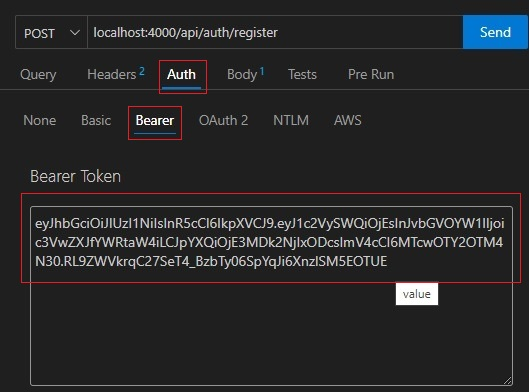

# Tattoo Studio :black_nib:
Bienvenido a la documentación de la API de mi red social. Es mi quinto proyecto desarrollado en GeeksHubs Academy en el cual se ponen en práctica habilidades de desarrollo backend con JavaScrpt y MongoDB Compass.

## Tabla de contenido :page_with_curl:

- [Tecnologías.](#tecnologías)
- [Diagrama.](#diagrama-bd)
- [Instalación en local.](#instalación-en-local)
- [Usuarios modelo](#usuarios-modelo)
- [Endpoint.](#endpoints)
- [Futuras funcionalidades.](#futuras-funcionalidades)
- [Autor.](#autor)
- [Agradecimientos.](#agradecimientos)

### Tecnologías :star2:

     

### Diagrama BD :book:


### Instalación en local :gear:

**1. Clona el repositorio.**
````

````
**2. Instalar las dependencias.**
````
$ npm install
````
**3. Poner en marcha el servidor.**
````
$ npm run dev
````

**5. Ejecutar los seeders.**
````
$ npm run seed
````

### Usuarios modelo :pouting_face:
#### User
````
Nombre: user
Email: user@user.com
Contraseña: 123456
````
#### Admin
````
Nombre: admin
Email: admin@admin.com
Contraseña: 123456
````
#### Superadmin
````
Nombre: super_admin
Email: super_admin@super_admin.com
Contraseña: 123456
````

### Endpoints :dart:
##### Autenticación
- `POST /api/auth/register` - **Registrar nuevo usuario.**
Pasamos los siguientes datos por el body. Ejemplo:
````
{
   "name": "nombre",
   "email": "email@email.com",
   "password": "contraseña"
}
````

- `POST /api/auth/login` - **Inicio de sesión.**
Pasamos los siguientes datos por el body. Ejemplo:
````
{
  "email": "email@email.com",
  "password": "contraseña"
}
````
##### Usuarios

- `GET /api/users` - **Ver todos los usuarios.** Pasamos el token del propio usuario. 


- `GET /api/users/profile` - **Ver perfil de usuario.**
Pasamos el token del propio usuario.

- `PUT /api/users/profile` - **Modificar datos del perfil.**
Pasamos el token del propio usuario y los datos que queramos modificar por el body. Ejemplo:
````
{
  "name": "Nombre",
  "email": "email@email.com"
}
````


- `DELETE /api/users/{id}` - **Eliminar usuario. (Solo el superadmin)**
Pasamos el token del superadmin y el id del usuario a eliminar por parámetro.


- `PUT /api/users/{id}/role` - **Modificar el role del usuario. (Solo el superadmin)**
Pasamos el token del superadmin y el id del usuario a modificar por parámetro.


##### Posts
- `POST /api/posts` - **Crear post.**
Pasamos el token del usuario y los siguientes datos por el body. Ejemplo:
````
{
  "description": "texto"
}
````

- `DELETE /api/posts/{id}` - **Eliminar un post.**
Pasamos el token del creador del post y el id del post a eliminar por parámetro.

- `PUT /api/posts` - **Actualizar mi post.**
Pasamos el token del creador del post y por el body los datos que deseemos actualizar. Ejemplo:
````
{
  "description": "texto 2"
}
````
- `GET /api/posts/own` - **Ver todos mis posts.**
Pasamos el token del usuario para ver sus posts.

- `GET /api/posts` - **Ver todos los posts.**
Pasamos el token del usuario para todos los posts.

- `GET /api/posts/{id}` - **Ver un post.**
Pasamos el token del usuario y el id del post por parámetro..

- `GET /api/posts/{id}` - **Recuperar una cita.**
Pasamos por parametro el numero de id del servicio que queramos recuperar.


##### Servicios
- `GET /api/services` - **Ver todos los servicios.**
- `POST /api/services` - **Crear un servicio. (Solo el superadmin)**
Pasamos el token del superadmin y los siguientes datos por el body. Ejemplo:
````
{
"service_name": "Personalized tattoo",
"description": "Customers will have the freedom to select unique motifs and designs, fully customizing their tattoo experience according to their preferences and tastes."
}
````
- `PUT /api/services/{id}` - **Modificar un servicio. (Solo el superadmin)**
Pasamos el token del superadmin y los datos a modificar por el body.


### Futuras funcionalidades 	:rocket:
- Posibilidad de elegir entre distintos tatuadores.

### Autor :curly_haired_man:
- **Víctor Blasco** - Project Developer.
   - [GitHub](https://github.com/VictorBlasco5)

### Agradecimientos 
- Agradecimiento a GeeksHubs Academy por su implicación en mi aprendizaje.